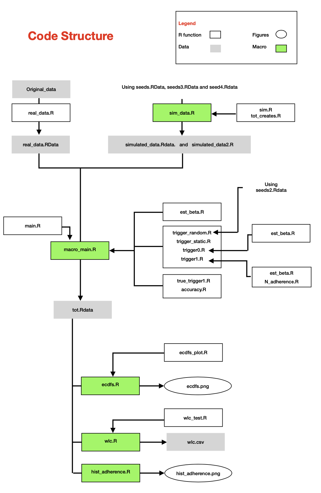

```{r setup, include=FALSE}
knitr::opts_chunk$set(echo = TRUE)
```

## Adaptive data collection for intra-individual studies affected by adherence

Code related to the paper "Adaptive data collection for intra-individual studies affected by adherence" (Monacelli et al., 2022). The code was developed and executed with the R version 4.0.5 (2021.03.31).  

## Usage

The structure of the code is detailed in the following graph.

{width=50%}


In particular, the figures and tables in the paper were obtained through the following scripts. 

```{r, eval=TRUE, echo=FALSE}
library(xtable)
Results = c("Figure 1", "Figure 2", "Figure 3", "Figure 4", "Table 1", "Table 2")
Scripts = c("do_problem.R", "reprgraph.R", "ecdfs.R", "hist_adherence.R", "wlc_sim.R", "wlc_real.R")
tab = data.frame(Results, Scripts)

print(tab, type = "html")
```

Table 2 and a portion of Figure 3 can not be replicated by the user because of privacy issues with the tinnitus dataset. Nevertheless, the code which produced them is included. Algorithm 1 and Algorithm 2 of the paper are implemented, respectively, in the scripts "trigger0.R" and "trigger1.R".

## Contact

Greta Monacelli (greta.monacelli2@mail.dcu.ie)


