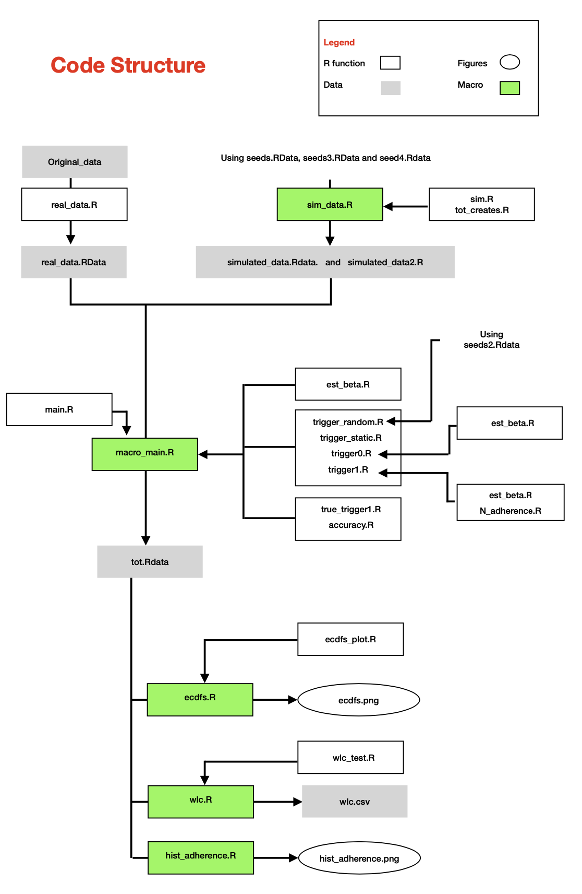
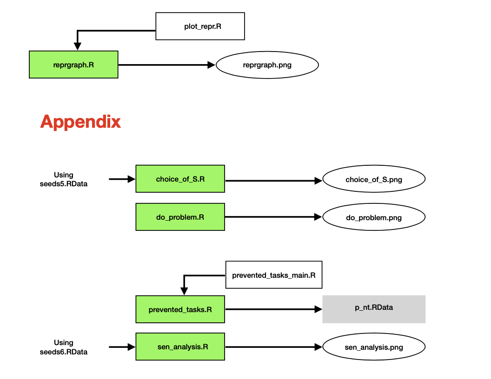

# adc-tinnitus
adaptive data collection for intra-individual studies affected by adherence

# Adaptive data collection for intra-individual studies affected by adherence

Code related to the paper "Adaptive data collection for intra-individual studies affected by adherence" (Monacelli et al., 2022). The code was developed and executed with the R version 4.0.5 (2021.03.31).  

## Usage

Before starting, make sure to set up the working directory for RStudio to the right folder. 

The structure of the code is detailed in the following graph. 

By executing all the scripts highlighted in green, it is possible to generate all the results presented in the manuscript. Part of Table 1 and a portion of Figures 2 and 3 can not be replicated by the user because of privacy issues with the TrackYourTinnitus data set. Nevertheless, the code which produced them is included and a fake "real_data.RData" file has been added to simualate similar results. The TrackYourTinnitus data is available on request (winfried.schlee@ieee.org).

In particular, the Figures and Tables in the paper were obtained through the following scripts. 

| Results  |  Scripts          |
| -------- | ---------------   |
| Figure 1 |  reprgraph.R      | 
| Figure 2 |  hist_adherence.R | 
| Figure 3 |  ecdfs.R.         |
| Table 1  |  wlc.R    |

On the other hand, in the following we give the scripts which generate Figures and Tables in the Supplement. 

| Results  |  Scripts          |
| -------- | ---------------   |
| Figure 1 |  choice_of_S.R.    |
| Figure 2 |  do_problem.R.    |  
| Table 1 |  prevented_tasks.R.    |  
| Figure 3 |  sen_analysis.R.    | 

Notice that the orca package is necessary to automatically export the Figures generated trhough plotly. Algorithm 1 and Algorithm 2 as defined in the manuscript are implemented, respectively, in the scripts "trigger0.R" and "trigger1.R". 

## Contact

Greta Monacelli (greta.monacelli2@mail.dcu.ie)

## SessioInfo
R version 4.0.5 (2021-03-31)

Platform: x86_64-apple-darwin17.0 (64-bit)

Running under: macOS Big Sur 10.16

Matrix products: default

LAPACK: /Library/Frameworks/R.framework/Versions/4.0/Resources/lib/libRlapack.dylib

locale:

[1] en_IE.UTF-8/en_IE.UTF-8/en_IE.UTF-8/C/en_IE.UTF-8/en_IE.UTF-8

attached base packages:

[1] stats     graphics  grDevices utils     datasets  methods   base     

other attached packages:

[1] processx_3.5.2 plotly_4.9.3   ggplot2_3.3.3 

loaded via a namespace (and not attached):

 [1] pillar_1.6.0      compiler_4.0.5    tools_4.0.5       digest_0.6.27     viridisLite_0.3.0
 
 [6] jsonlite_1.7.2    evaluate_0.14     lifecycle_1.0.0   tibble_3.1.1      gtable_0.3.0 
 
[11] pkgconfig_2.0.3   rlang_0.4.11      DBI_1.1.1         crosstalk_1.1.1   yaml_2.2.1 

[16] xfun_0.22         withr_2.3.0       dplyr_1.0.6       httr_1.4.2        knitr_1.30 

[21] generics_0.1.0    vctrs_0.3.8       htmlwidgets_1.5.3 grid_4.0.5        tidyselect_1.1.0

[26] glue_1.4.2        data.table_1.13.4 R6_2.5.0          fansi_0.4.1       rmarkdown_2.8  

[31] farver_2.0.3      tidyr_1.1.3       purrr_0.3.4       magrittr_2.0.1    ps_1.5.0  

[36] scales_1.1.1      ellipsis_0.3.1    htmltools_0.5.0   assertthat_0.2.1  colorspace_2.0-0 

[41] utf8_1.1.4        lazyeval_0.2.2    munsell_0.5.0     crayon_1.4.1      
